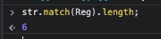
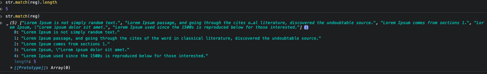

# 정규 표현식 마스터하자

## Member

- ### Sangheon Kim
  - #### ksj8367@gmail.com (email)
  - #### @sangheon-kim (github)
- ### Jaehyun Choi
  - #### re.you.cat@gmail.com (email)
  - #### @reyoucat (github)

### 테스트 문장

```js
const str = `Where does it come from?
Contrary to popular belief, Lorem Ipsum is not simply random text. It has roots in a piece of classical Latin literature from 45 BC, making it over 2000 years old. Richard McClintock, a Latin professor at Hampden-Sydney College in Virginia, looked up one of the more obscure Latin words, consectetur, from a Lorem Ipsum passage, and going through the cites of the word in classical literature, discovered the undoubtable source. Lorem Ipsum comes from sections 1.10.32 and 1.10.33 of "de Finibus Bonorum et Malorum" (The Extremes of Good and Evil) by Cicero, written in 45 BC. This book is a treatise on the theory of ethics, very popular during the Renaissance. The first line of Lorem Ipsum, "Lorem ipsum dolor sit amet..", comes from a line in section 1.10.32.

The standard chunk of Lorem Ipsum used since the 1500s is reproduced below for those interested. Sections 1.10.32 and 1.10.33 from "de Finibus Bonorum et Malorum" by Cicero are also reproduced in their exact original form, accompanied by English versions from the 1914 translation by H. Rackham.
```

## Day 01

<hr />

- Page 46 - 51 (01. 리터럴 텍스트에 일치, 02 - 비인쇄 문자에 일치)
  - 과제 : 위 테스트 문장에서 Lorem의 개수를 출력하라
    

`Sangheon`

```js
const reg = new RegExp(/lorem/, "gim");

str.match(reg).length;
```

`JaeHyeon`

```js

```

## Day 02

<hr />

- Page 52 ~ 59 (03. 여러 문자 중 하나와 일치, 04. 모든 문자와 일치)
  - 과제 : 위 테스트 문장에서 Lorem이 포함되는 문장을 추출하고, 길이 값 출력



`Sangheon`

```js
const reg = new RegExp(/Lorem+.+?\./, "gim");

str.match(reg);

str.match(reg).length;

for (let sentence of str.matchAll(reg)) {
  console.log(key);
}
```

`JaeHyeon`

```js

```
